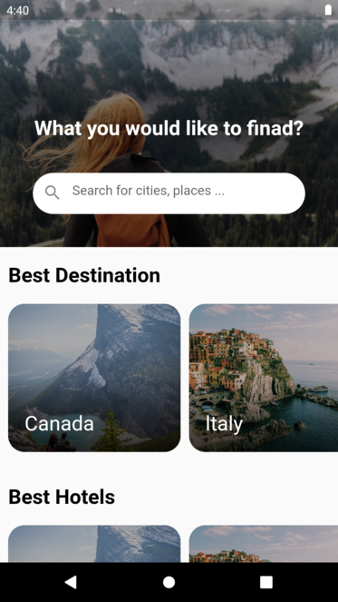
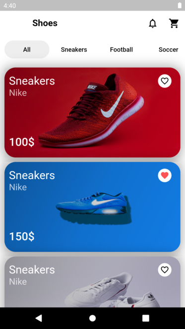

# Flutter UI Design Day 11 20

## Development Setup
Clone the repository and run the following commands:
```
flutter pub get
flutter run
```

# ScreenShot
## Day 11 - Travel Application UI Concept


## Day 12 - Login Page UI Design


## Day 13 - Login Page UI Design


## Day 14 - Login Page UI Design


## Day 15 - Shopping Application UI Design
&nbsp;

## Day 16-17 - e-commerce Application UI Design
&nbsp;&nbsp;

## Day 18 - Carousel UI Design
&nbsp;

## Day 19 - Facebook Application UI Redesign
&nbsp;

## Day 20 - Socks Shop Application
&nbsp;&nbsp;

# Educational content provided by Afgprogrammer
[Youtube Afgprogrammer channel](https://youtube.com/afgprogrammer)
